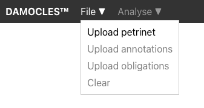
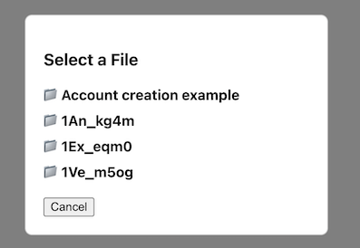
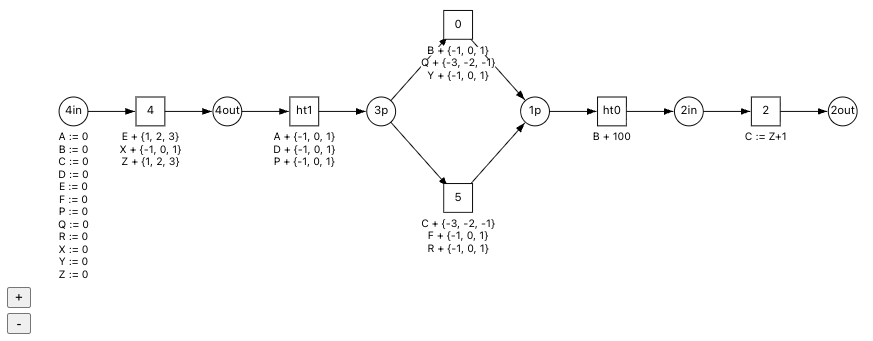
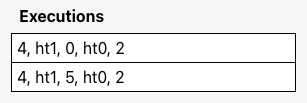
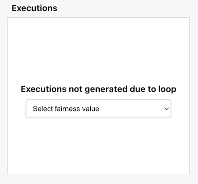
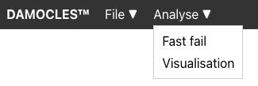
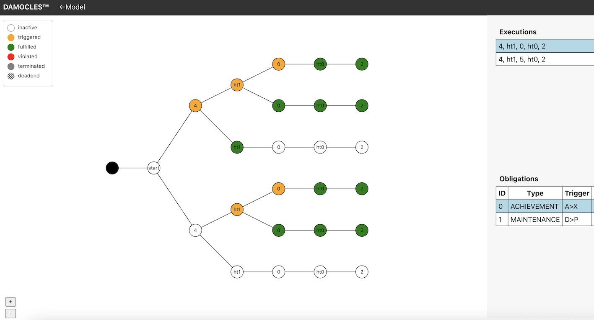
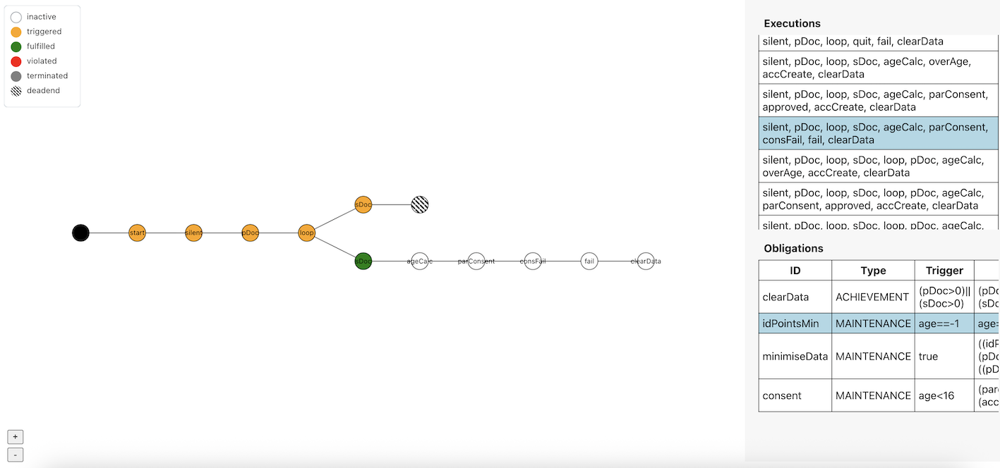

# How to use [damocles-analysis.com](https://damocles-analysis.com)

## File upload

The model is created by uploading 3 files

- petrinet
- annotations (write operations and guard conditions) 
- obligations

They must come from the same folder to be compatible

  
## Model view

Once all files are uploaded, the petrinet and annotations will be rendered in the left pane.
Larger petrinets can be navigated through the zoom in/out buttons and scrolling

## Execution view

The list of executions associated to the petrinet will be shown in the top right pane. 
For petrinets with a larger number of executions, this table can be scrolled. 

If petrinet has loops, the number of executions is infinite and therefore cannot be generated. Instead, there is an option to select a fairness value from 1-5, which limits the number of times the loop can be repeated, and the resulting executions will be displayed. 

## Obligation view

The list of obligations associated to the model will be shown in the bottom right pane. 
Obligations must contain unique IDs, and have type either achievement or maintenance.
The three conditions (trigger, requirement and deadline) affect the obligation's state depending on the type's automata (given in paper). 

## Analysis

The analysis menu allows users to run our symbolic compliance checker to determine the compliance. There are two options:
- Fast fail
  - Will return the Boolean of whether the model is compliant using the shared prefix method
  - This can be used even for models with loops (without requiring fairness) as long as the loop is known to be finite
- Visualisation
  - Will generate the analysis tree for all execution and obligation pairs
  - For models with loops, this is only enabled once a fairness value is selected, in order to have a finite number of execution pairs
  - When ready, the menu bar will show a button to enter the visualisation view 

## Visualisation

In the visualsation view, the left pane shows the analysis tree. 
Each column in the tree is a transition in the selected execution, with branches showing different states of the selected obligation instance.

Each execution/obligation pair has its own tree, and these can be navigated by selecting different executions or obligations in the right pane.

Dead-ends occur when at some transition in the execution, the guard condition is false for all interpretations on the branch. 
In that case, there will be a separate execution where those values take a different transition at the XOR-split in the petrinet. 

This can be seen in the account creation example. For example, the execution:

    silent, pDoc, loop, sDoc, ageCalc, parConsent, consFail, fail, clearData

Which contains a primary upload followed by secondary upload, then exiting the loop. 
The possible ID points is primary (70) + secondary (one of 25, 35, 40), giving an overall of 95, 105 or 110.
This creates a branch in the idPointsMin obligation after the secondary upload, as 105 and 110 fulfill the obligation, whereas 95 does not. 
However, the subsequent transition ageCalc is guarded by idPoints>=100. And so the branch containing 95 reaches a deadend on this execution. 
Instead, that interpretation would be found on executions of the same prefix that instead go back into the loop. We see this in the visualisation below. 

To return back to the model uploader page, click the model button in the top right.

